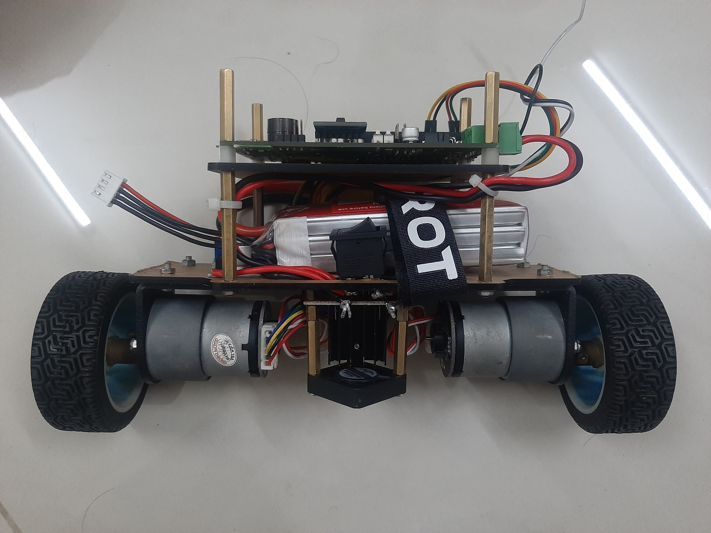
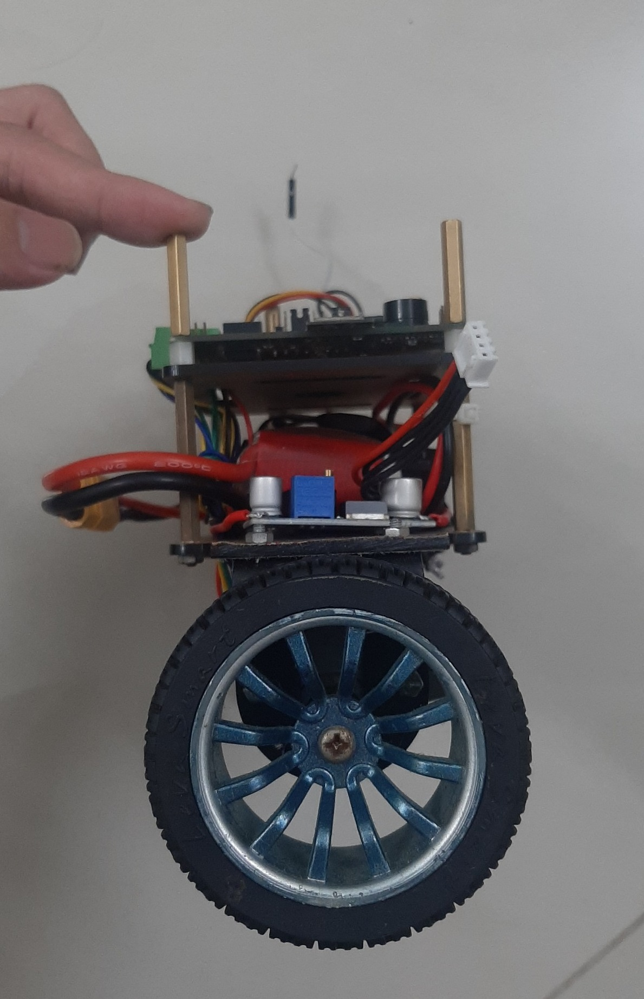

# Fuzzy-Balancing-Robot

  
  

PIFWRobot is an open source project for two-wheeled self-balancing robot.

## Hardware
*  1 STM32F103C8T6
*  1 MPU6050
*  2 DC Motors
*  1 L298N DC Motor Driver
*  1 12.6V Li-po battery 

## Fuzzy Logic control algorithm

## License & copyright
@ Thinh Nguyen Phuc, Ho Chi Minh City University of Technology

Licensed under the [MIT license](LICENSE)